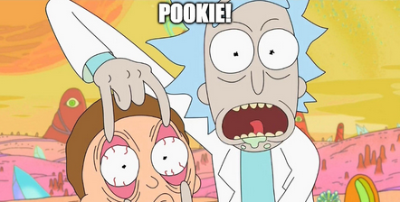

# pookie
Tiny object database for use as application state. The query engine is a map/filter/reduce function that automatically re-runs on record change and add.

## About

How do you keep track of views of data that depend on other views of data?
How do you make it easy to understand, to visualize, strategize and manage?

## Tree

### The root of a tree can be viewed as a list of objects:

        [{}
         {}
         {}
         {}
         {}
         {}
         {}
         {}
         {}
         {}]

### Todo List Example:  At first consider only one layer of views:

        [{}  complete tasks     <-\
         {}  ^                     \
         {}  |                      }------ VIEWS OF DATA!
         {} /                      /
         {}/  incomplete tasks  <-/
         {}  ^
         {} /
         {}/
         {}
         {}
         {}] <-- tree root is a list of all tasks

### Like with glasses, you will know when you need them

In the todo app example you will need them (nested views) when adding a PRIORITY VIEW

      [{}  complete tasks   
       {}  ^                  priority incomplete tasks
       {}  |                  ^
       {} /                  /    
       {}/  incomplete tasks/
       {}  ^
       {} /
       {}/
       {}
       {}
       {}] <-- tree root is a list of all tasks

### Many, many, more.

Let us switch to a more comfortable tree format:

- All Tasks
  - Completed Tasks
  - Incomplete Tasks
    - Priority Tasks

And extend out tree of views with more ideas:

- All Tasks
  - Completed Tasks
    - Starred
    - Archived
    - Expired
  - Incomplete Tasks
    - Today's Tasks
      - High Priority
        - Starred
      - Low Priority
    - Recurring
    - Expired
    - Starred
  - Drafts
    - All
    - Recurring

As you can see, even a tiny program, can ballon out to a complex tree. Now consider multiple users, multiple administrators, and unforeseen features and the above tree can explode into dozens of views.

With pookie the state of your data is easy to see, predictable, and consistent. It is just a Node, with Nodes.

